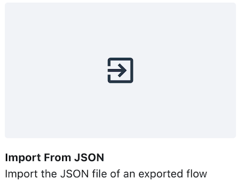
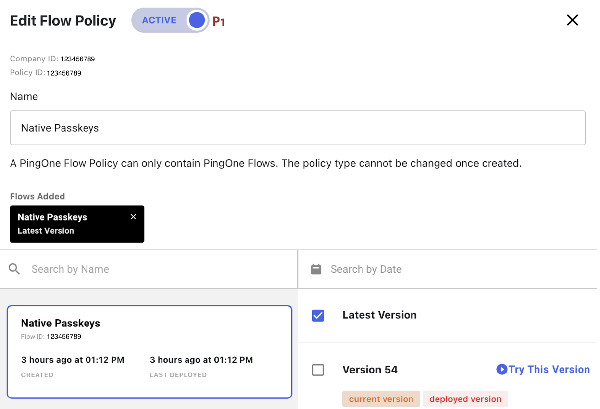

# Passkey implementation for iOS mobile app with PingOne DaVinci

## Overview

This section contains information regarding passkey implementation in the PingOne MFA sample app for iOS, using a DaVinci server-side solution. Passkeys provide an additional layer of security and user verification, enhancing the trustworthiness of your app. Follow these instructions to integrate passkeys into your own iOS application seamlessly.

**Note**: The passkey implementation relates to the PingOne server, not the mobile SDK. The sample app demonstrates how to implement passkey usage in a native iOS app.

## Prerequisites

The following are prerequisites if you want to implement passkey usage:

* Download the latest version of the sample app repository.
* Ensure your app targets iOS version 16.0 and above.
* Use Xcode 14.0 or above.
* Familiarize yourself with Apple's [documentation](https://developer.apple.com/documentation/authenticationservices/public-private_key_authentication/supporting_passkeys) on supporting passkeys to understand the iOS side of the implementation.

## Implementation steps

<a name="davinci_setup"></a>
### 1. DaVinci setup
In this sample app, we use the DaVinci implementation to function as the backend for the passkeys flows. Using DaVinci is not mandatory. The backend can be anything that is backed by PingOne MFA.

**Note**: If you use a different backend to implement the FIDO server calls, skip this step and go to [Association file setup](#association_file_setup).

#### PingOne environment
Create a PingOne environment if you don't already have one.

#### DaVinci - import flow and create an application and a policy to invoke it

1. Sign on to your PingOne account.
2. Open the DaVinci admin console: Main menu → PingOne Services → DaVinci.

    

**Note**: If you don’t see DaVinci on the menu, add it to your environment: Main Menu → Overview → add DaVinci to the list of services.

3. In DaVinci, on the Connectors tab, make sure you have `PingOne` & `PingOne MFA` connectors set up for your environment.

4. Import the Native Passkeys flow:
    1. Download the [Native_Passkeys.json](./Native_Passkeys.json) file to your computer (it is in the sample app repository).
    2. Navigate to Flows.
    3. Click Add Flow.
    4. Choose Import from JSON and select the file Native_Passkeys.json.

        

5. Create application and policy:
    1. In DaVinci, navigate to Applications.
    2. Click Add Application and give it a name (for example, "Native Passkeys").
    3. Click the new application to edit it.
    4. Click Flow Policy → Add Flow Policy.
    5. Give the policy a name.
    6. Select the Native Passkeys flow and choose Latest Version.

        
        
    7. Click Create Flow Policy.
    8. Set the weight to 100% and click Save Flow Policy.

#### PingOne application

Create an OIDC application to run the DaVinci flow:

1. In your PingOne environment, navigate to Connections → Applications. 
2. Create an OIDC application and enable it.
3. Go to the Policies tab for the new application.
4. Click the pencil button to edit.
5. Go to the DaVinci Policies section. 
6. Select the policy you created in DaVinci (make sure it’s the only one checked).
7. Go to the Overview tab for the application and copy the Client ID. 

#### FIDO policy

1. In your PingOne environment, navigate to Experiences → Policies → FIDO 
2. You will see a FIDO policy called _Passkeys_. Make sure it is set as the default FIDO policy. Open the _Passkeys_ policy and verify that it has the following settings:
    1. Relying Party ID should be set to your `domain` (the domain where you have `.well-known/assetlinks.json` and `.well-known/apple-app-site-association`).
    2. Discoverable Credentials set to `Required`.
    3. User Verification set to `Required`.
    4. Backup Eligibility set to `Allow`.

#### Flow endpoints
The endpoints for registering and authenticating when using passkeys are as follows (replace the variables where applicable).
These endpoints always return HTTP code 200. If an error occurs, the error details are found in the response body, in `httpBody.error`.

**Note:** The URLs in the example refer to the North America geography. If your environment is in a different geography, use:

    `auth.pingone.eu` for Europe
    `auth.pingone.ca` for Canada
    `auth.pingone.ap` for Australia

#####Start username-less authentication
GET https://auth.pingone.com/{{envId}}/as/authorize?client_id={{client_id}}&scope=openid&response_type=code&response_mode=pi.flow
    
In the response, save:

    additionalProperties.publicKeyCredentialRequestOptions
    additionalProperties.deviceAuthenticationId

#####Complete the authentication and get the username
GET https://auth.pingone.com/{{envId}}/as/authorize?client_id={{client_id}}&scope=openid&response_type=code&response_mode=pi.flow&deviceAuthenticationId={{deviceAuthenticationId}}&assertion={{assertion}}&rpId={{rpId}}

In the response, get: 

    additionalProperties.username

#####Start passkeys registration
GET https://auth.pingone.com/{{envId}}/as/authorize?client_id={{client_id}}&scope=openid&response_type=code&response_mode=pi.flow&username={{username}}&password={{password}}
    
In the response, save:
 
    additionalProperties.publicKeyCredentialCreationOptions
    additionalProperties.userId
    additionalProperties.deviceId

#####Complete the registration
GET https://auth.pingone.com/{{envId}}/as/authorize?client_id={{client_id}}&scope=openid&response_type=code&response_mode=pi.flow&userId={{userId}}&deviceId={{deviceId}}&attestation={{attestation}}&rpId={{rpId}}


### 2. Get environment credentials

Next, get the values for the following credentials, referred to in the Davinci setup section:

    `environment id`
    `client id`
    `base url` (for example, `auth.pingone.com`)
    `domain`
In the sample app's `Constants.Swift` class, replace these credentials with the relevant values. 

**Note:** `domain` represents the relying party responsible for registering or authenticating the device. It should be your server's unique domain for this purpose.

<a name="association_file_setup"></a>
### 3. Association file setup

#### Create an association file

To associate your website with the app, you need to create an associated domain file on your website and configure the appropriate entitlements in your app. Refer to Apple's documentation for detailed instructions. Note that after uploading the apple-app-site-association (AASA) file, Apple's CDN may take up to 24 hours to update its cache. You can check the AASA file status using the Apple tool at `https://app-site-association.cdn-apple.com/a/v1/<YOUR_DOMAIN>`.

Example for the `apple-app-site-association` JSON file can be found [here](https://developer.apple.com/documentation/xcode/supporting-associated-domains#Add-the-associated-domain-file-to-your-website:~:text=The%20following%20JSON%20code%20represents%20the%20contents%20of%20a%20simple%20association%20file).

Here's a simplified JSON example:

```json
{
  "applinks": {
    "details": [
    ]
  },
  "webcredentials": {
    "apps": [ "ABCDE12345.<YOUR_DOMAIN>" ]
  },
  "appclips": {
    "apps": [
    ]
  }
}
```

**Note**:
* In order for passkeys to work, need to set the `webcredentials` object as shown above.
* `ABCDE12345` is a placeholder for your developer team ID.
* `<YOUR_DOMAIN>` should be the same value as `Domain` in the `\Modal\Constants.Swift` class.
* In case you need this file to support several applications, add them separately into the `webcredentials` in the `apps` array in the json above.
* Make sure your apple-app-site-association file is properly formatted using tools such as [this](https://yurl.chayev.com/).

#### Xcode setup

Add the associated domain capability:

- In your developer account, add the associated domain capability to your app identifier. Refer to the documentation [here](https://developer.apple.com/documentation/xcode/configuring-an-associated-domain).

- In your Xcode project, add the "Associated Domains" capability by specifying `webcredentials:<YOUR_DOMAIN>`.

### 4. Passkey flow implementation

The mobile app includes `PasskeysViewController.Swift` to handle user-initiated sign-on actions and `PKDeviceFlowManager.Swift` to manage all modal layers, including server requests and responses and passkey manager communications.

The passkey manager `PKManager.swift` requires a UIWindow from the app to display passkey popup sheets.

The communication manager initializes the passkey manager instance and executes the sign-up and sign-on flows as needed. It listens for responses and retrieves iOS attestation and assertion objects to validate them with the server.

#### Authentication

```swift
static func signIn(anchor: ASPresentationAnchor) {
    // See code in the repo
}
```

The `anchor` parameter represents a UIWindow instance where the passkey UI will be displayed for user interaction during sign-up or sign-on.

#### Registration
```swift
static func signUp(anchor: ASPresentationAnchor) {
    // See code in the repo
}
```

`userName` — A string value representing the user’s name for signing up with a passkey. This value is optional and will be presented in the passkey popup UI.

`userId` — Data[UInt8], the unique user ID the server will return along with the challenge to create a unique passkey for a user. The OS connects the userId to the passkey and will later verify this connection in the sign-on flow with the userHandle value.

`challenge` — Data[UInt8], unique data object the server will create for the specific userId. In accordance with the webAuthn spec, the server returns the challenge as an integer array in the publicKeyCredentialCreationOptions object, which will be an integer array. It is necessary to convert it into an unsigned Int8 array and create a Data object.

`anchor` — UIWindow instance the app passes to the AuthenticationService delegate, which will be the UI place for the passkeys to show up and get user interaction to approve signing up a new passkey or later for signing on.

#### Retrieving attestation and assertion objects
In this section of the code, you'll handle the responses from passkey registration and authentication, processing the attestation and assertion objects accordingly.

```swift
func authorizationController(controller: ASAuthorizationController, didCompleteWithAuthorization authorization: ASAuthorization) {
    // See code in the repo
}
```

`domain` represents the relying party responsible for registering or authenticating the device.

`rawId` and `id` are the same value but in different formats. `rawId` is a base64-encoded string while `id` is URL-encoded.

`authenticatorAttachment` and `clientExtensionResults` are optional.

In this example, the server expects to get the `attestation` and `assertion` objects (payload) in JSON string format. 

`type` field is always set to "public-key".

#### Handle responses
The `PKDeviceFlowManager.Swift` class manages all communication with the server and the user interface. Notifications are used to observe iOS responses to passkey requests for registration and authentication.


## Disclaimer

THE SAMPLE CODE IS PROVIDED "AS IS", WITHOUT WARRANTY OF ANY KIND, EXPRESS OR IMPLIED, INCLUDING BUT NOT LIMITED TO THE WARRANTIES OF MERCHANTABILITY, FITNESS FOR A PARTICULAR PURPOSE AND NONINFRINGEMENT. IN NO EVENT SHALL THE AUTHORS OR COPYRIGHT HOLDERS BE LIABLE FOR ANY CLAIM, DAMAGES OR OTHER LIABILITY, WHETHER IN AN ACTION OF CONTRACT, TORT OR OTHERWISE, ARISING FROM, OUT OF OR IN CONNECTION WITH THE SAMPLE CODE OR THE USE OR OTHER DEALINGS IN THE SAMPLE CODE.  FURTHERMORE, THIS SAMPLE CODE IS NOT COMMERCIALLY SUPPORTED BY PING IDENTITY BUT QUESTIONS MAY BE ADDRESSED TO PING'S SUPPORT CENTER OR MAY BE OTHERWISE ADDRESSED IN THE RELATED DOCUMENTATION.

Any questions or issues should go to the support center, or may be discussed in the [Ping Identity developer communities](https://support.pingidentity.com/s/topic/0TO1W000000atTxWAI/pingone-mfa).
